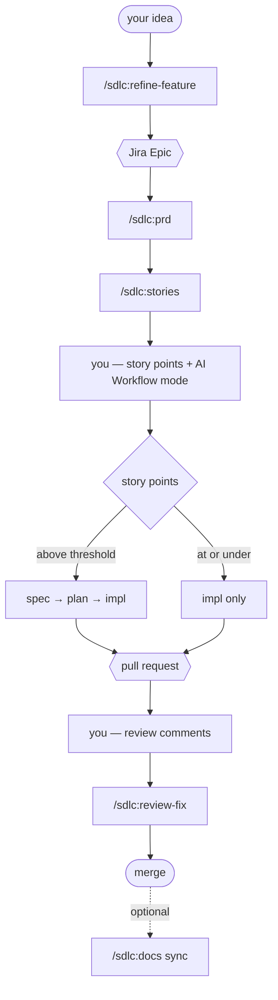

<div align="center">

# 🌙 nightshift

## Your AI software team that ships while you sleep.

**A drop-in [Claude Code](https://claude.com/claude-code) plugin marketplace that turns one terminal into a full software-delivery team — Product Manager, Architect, Tech Lead, Engineers, QA, and Knowledge — driven straight from your issue tracker.**

`Jira ticket → spec → plan → implementation → review → PR → docs.` Automatically. In any repo.

[](https://code.claude.com/docs/en/plugins)
[](https://github.com/whimzyLive/nightshift-ai)
[](LICENSE)

[](https://github.com/whimzyLive/nightshift-ai)

[**Install**](#-install-in-60-seconds) · [**Workflow**](#-your-side-of-the-workflow) · [**How it works**](#-how-it-works) · [**The team**](#-meet-your-team) · [**Commands**](#-the-commands) · [**Docs engine**](#-the-docs-engine) · [**Configure**](#-configure-your-repo) · [**Extend**](#-extend-the-agents-to-your-stack) · [**FAQ**](#-faq) · [**Contribute**](#-contributing)

</div>

---

> ⭐ **If this saves you a sprint, star the repo.** It's how other builders find it.

## The problem

You don't lose time _writing_ code. You lose it in the **connective tissue** around it: turning a vague ticket into a real spec, breaking that spec into a plan, keeping the plan honest while you implement, reviewing it without rubber-stamping your own work, then writing the docs nobody wants to write.

AI coding assistants are great at the middle 20%. nightshift automates the other 80% — the **process** — by giving Claude Code a team of specialized agents that each own one stage of the lifecycle and hand off cleanly to the next.

## What it is

**nightshift** is a Claude Code plugin marketplace. Its flagship plugin, **`sdlc`**, installs a repo-agnostic software-delivery team:

- **A full team of specialized agents** — one per role, each with a tight charter and clean handoff protocol.
- **The whole lifecycle as slash commands** — one verb at a time: `/sdlc:spec`, `/sdlc:plan`, `/sdlc:impl`, `/sdlc:review`, plus a one-shot `/sdlc:auto`.
- **Issue-tracker native** — reads a ticket, derives the branch, the plan path, the PR. Closes the loop back to Jira/GitHub.
- **A docs engine** — `/sdlc:docs` regenerates reference docs, ADRs, changelogs, and `llms.txt` from the sources they describe, so your docs surface can't silently drift.
- **Zero hardcoding** — every project-specific fact (stack, paths, Jira key, base branch) lives in one config file per repo. The agents are 100% generic. Install once, use everywhere.

It is **not** a wrapper that "writes code for you." It's a process engine that makes a senior team's _discipline_ the default — spec before plan, plan before code, review before merge, tests as the gate.

## ⚡ Install in 60 seconds

In any Claude Code session:

```text
/plugin marketplace add whimzyLive/nightshift-ai
/plugin install sdlc@nightshift
```

That's it. The plugins `sdlc` depends on install **automatically** as cross-marketplace dependencies — [superpowers](https://github.com/obra/superpowers) for the shared workflow skills, and claude-mem for the learnings corpus that `/sdlc:docs distill` mines. An existing install is reused and a missing one is pulled in for you. No duplicate copies, no version juggling.

> **Prerequisites:** Claude Code, plus the `acli` (Jira) and `gh` (GitHub) CLIs for the ticket/PR integrations. Both are optional if you only want the spec/plan/impl/review flow locally.

📖 **Step-by-step first run → [`docs/tutorials/getting-started-with-sdlc.md`](docs/tutorials/getting-started-with-sdlc.md)**

## 🎬 Watch it ship a real site, overnight

<div align="center">

[](https://github.com/whimzyLive/nightshift-ai/raw/main/apps/marketing/public/hero-promo.mp4)

<sub>▶️ <a href="https://github.com/whimzyLive/nightshift-ai/raw/main/apps/marketing/public/hero-promo.mp4"><b>Watch the demo</b></a> · 2 min · no audio</sub>

</div>

We handed nightshift **one epic** — _"build our own marketing site"_ — and ran `/auto` unattended. It split the epic into **10 user stories**, ordered them by dependency, and worked through the night alone: every phase on every story, **19 PRs merged**, CI green on lint, types, tests, and e2e. The reviewer agent caught real defects along the way. **Zero humans in the loop.**

The result is [withnightshift.com](https://withnightshift.com) — a real Next.js + Payload CMS site, not a static page. The video fast-forwards the actual 8-hour terminal run.

## 🛠️ Your side of the workflow

What you actually type, from an empty repo to a merged PR.

### Preparation — once per repo

1. **`/sdlc:init`** — checks the `gh`/`acli` prerequisites, walks you through Jira auth, scans your stack, then scaffolds `.claude/project/project-context.md`, your active agents' override files, and the project skills manifest. The next four steps are all prompts inside this one command.
2. **Teach it your stack** — install the skills your codebase needs and bind each one to the domain agent that should invoke it. ([Full walkthrough →](EXTENDING.md))
3. **Set the lightweight threshold** — any story at or under it (default **3 points**) skips spec and plan and cuts straight to implementation. Everything above gets the full ceremony.
4. **Pick your reviewer and when it runs** — _Review agent_ is `claude-inline` (default, works on any repo), `github-copilot`, or `claude-superpowers`; _Review mode_ is `none`, `on-create`, or `on-update`.

Re-running `/sdlc:init` later is safe — it merges rather than overwrites.

### Working — per feature



|     | You run                                       | What happens                                                                                            |
| --- | --------------------------------------------- | ------------------------------------------------------------------------------------------------------- |
| 1   | `/sdlc:refine-feature`                        | Your idea becomes a Jira **Epic** — or enriches one you already created                                 |
| 2   | `/sdlc:prd`                                   | The Epic plus your context becomes a detailed PRD                                                       |
| 3   | `/sdlc:stories`                               | Stories, each linked to the Epic, with `Blocks` links and the build order written into the PRD          |
| 4   | _you_                                         | Assign story points and the automation mode; add labels and references                                  |
| 5   | `/sdlc:auto`<br>_or_ `spec` → `plan` → `impl` | Triages by size, then drives the story to a PR — one shot, or step by step if you want the controls     |
| 6   | `/sdlc:review-fix`                            | Triages your PR comments, keeps what's right for this codebase, implements them, replies on each thread |
| 7   | `/sdlc:docs sync`                             | Optional — folds the completed story into your docs surface                                             |

**Step 4 drives everything after it.** Story points decide the route: at or under your lightweight threshold, a story skips spec and plan entirely — no plan doc, no review gate, tasks derived inline from the ticket. Above it, the full ceremony. Automation mode comes from the Jira **AI Workflow** field (`Full Auto` / `Auto` / `Assisted`), falling back to an `AI-Workflow:full-auto` / `:auto` / `:assisted` **label** on projects without that custom field.

## 🧠 How it works

Four ideas do all the heavy lifting:

**1. A team, not a megaprompt.** Each role is a separate agent with its own system prompt, tools, and memory. The Product Manager can't touch infrastructure; the Platform Engineer can't invent acceptance criteria. Narrow charters mean fewer hallucinations and cleaner handoffs — the same reason real teams specialize.

**2. Agents for domain work, playbooks for orchestration.** Roles that _own files_ are subagents with their own context. The two orchestration roles — **principal-engineer** and **qa-engineer** — run as inline playbooks in your session instead, so they can dispatch domain agents and see their results without a context hop. Same charters, different execution model.

**3. Generic agents, per-repo config.** The agents carry **zero** project specifics. Everything that changes between repos — tech stack, owned paths, Jira project key, base branch, quality-gate commands — lives in a single `.claude/project/project-context.md` the plugin auto-loads every session via a SessionStart hook. Write that one file and the entire team adapts to your codebase.

**4. The lifecycle is the product.** Spec → plan → implement → review isn't a suggestion; it's enforced by the commands and the handoff protocol. Tests are the merge gate. Reviews are done by a _different_ agent than the one who wrote the code.

## 👥 Meet your team

Each stage of the lifecycle is owned by a separate role with its own charter and a clean handoff to the next — from the Product Manager who turns a ticket into a PRD, through the Scrum Master, Solutions Architect, Tech Lead, and domain Engineers (platform, web, mobile, database, sync), to the QA Engineer that gates the merge. Two support roles round it out: the **AI Enablement Engineer** keeps your repo's own AI config from drifting, and the **Knowledge Engineer** owns ADRs and the docs surface.

Standby roles activate only when your `project-context.md` says your project has them — a backend-only repo never spins up the mobile engineer.

📖 **Every agent and its charter, always current → [`docs/reference/agents/`](docs/reference/agents/)** — generated from the plugin sources, so the roster never drifts as roles are added.

## 🎛️ The commands

All commands are namespaced by plugin — `/sdlc:*`.

| Stage          | Commands                                                                      |
| -------------- | ----------------------------------------------------------------------------- |
| **Onboard**    | `/sdlc:init` · `/sdlc:analyze`                                                |
| **Shape work** | `/sdlc:refine-feature` · `/sdlc:prd` · `/sdlc:stories` · `/sdlc:refine-issue` |
| **Build**      | `/sdlc:triage` · `/sdlc:spec` · `/sdlc:plan` · `/sdlc:impl`                   |
| **Review**     | `/sdlc:review` · `/sdlc:review-fix` · `/sdlc:loop`                            |
| **End to end** | `/sdlc:auto`                                                                  |
| **Document**   | `/sdlc:docs`                                                                  |

📖 **Full command list with usage, always current → [`docs/reference/commands/`](docs/reference/commands/)** — generated from the command sources, so a newly added command shows up automatically and this README never advertises a stale set.

## 📚 The docs engine

Docs rot because nothing forces them to track the code. `/sdlc:docs` closes that loop — it runs behind the **knowledge-engineer** agent and treats your docs surface as generated output wherever it safely can be:

| Mode                       | What it does                                                                                           |
| -------------------------- | ------------------------------------------------------------------------------------------------------ |
| `/sdlc:docs sync`          | Diff-drives deterministic regen of reference docs + `llms.txt`; drafts gated refreshes for prose pages |
| `/sdlc:docs release <ver>` | Aggregates stories merged since the last tag into changelog, release notes, and a migration-guide stub |
| `/sdlc:docs seed <type>`   | Scaffolds one new narrative page for you to author at the confirm gate                                 |
| `/sdlc:docs seed adr`      | Records a known architectural decision as a numbered, indexed ADR                                      |
| `/sdlc:docs distill`       | Mines the accumulated learnings corpus for ADR-worthy patterns and drafts them                         |
| `/sdlc:docs audit`         | Scans every activated page for drift; auto-corrects mechanical rows via PR, flags narrative drift      |

Prose pages follow [Diátaxis](https://diataxis.fr/) — one page, one job (tutorial / how-to / reference / explanation). This repo eats its own dog food: [`docs/`](docs/), [`docs/adr/index.md`](docs/adr/index.md), and [`llms.txt`](llms.txt) are all produced by this pipeline.

## 🔧 Configure your repo

Each consuming repo supplies **one file** — `.claude/project/project-context.md` — declaring its constants. The plugin's SessionStart hook auto-loads it into every session; you never edit your `CLAUDE.md`.

> **Onboarding a fresh repo?** Run `/sdlc:init` — it checks the `gh`/`acli` prerequisites, walks you through Jira auth, and scaffolds `project-context.md` plus your active agents' override files interactively. The manual template below is the shape of what it produces.

```markdown
# Project Context

| Token            | Value                      |
| ---------------- | -------------------------- |
| Project name     | acme-api                   |
| Jira project key | ACME                       |
| Base branch      | develop                    |
| Package manager  | pnpm                       |
| Typecheck / Test | pnpm typecheck / pnpm test |

## Workspace → agent

| Path            | Owner             |
| --------------- | ----------------- |
| services/api/   | platform-engineer |
| apps/marketing/ | web-engineer      |
```

That's the whole integration. The agents read this, resolve their owned paths and quality gates from it, and adapt. Repo-agnostic by design — the same plugin runs your Node monorepo, your Python service, and your mobile app.

One optional sibling lives alongside it once you opt in: `docs-manifest.md`, which declares the doc types the docs engine keeps current.

## 🧩 Extend the agents to your stack

You almost never fork nightshift. The agents are generic; you teach them your stack from **your own
repo** — no edits to the shipped plugin, so upstream updates never fight your customizations. In short:

1. **Add a skill** — your stack's know-how in `.claude/skills/<name>/SKILL.md` (an ORM convention, a routing pattern, a deploy recipe…).
2. **Bind it to a role** — list it in that agent's override `.claude/project/agents/<agent>.md`; the agent invokes it via the Skill tool at runtime.
3. **Declare ownership + tooling once** — the workspace→agent table and quality-gate commands in `.claude/project/project-context.md`.

> **Rule of thumb:** project-specific knowledge → your repo's `.claude/`; generic role behavior → the plugin.

📖 **Full walkthrough with copy-paste templates → [EXTENDING.md](EXTENDING.md).**

## 💡 Why builders like it

- **Process for free.** The discipline of a senior team, encoded — without writing a runbook nobody follows.
- **Portable.** One install, every repo. Onboard a new project by writing a single config file.
- **Auditable.** Every stage leaves an artifact: a PRD, a spec, a plan, a review, an ADR. No black box.
- **Composable.** Built on open Claude Code primitives (agents, commands, skills, hooks) — fork it, extend it, swap a role.

## ❓ FAQ

**Does nightshift write code for me?**
No. nightshift is a process engine, not a "writes code for you" wrapper. It enforces the discipline around the code — spec before plan, plan before code, review before merge — with tests as the merge gate and a _different_ agent reviewing the work than the one who wrote it.

**How much does it cost?**
nightshift is free and MIT-licensed. Install it, fork it, extend it, and use it in any repo — commercial or otherwise — at no cost.

**Why are principal-engineer and qa-engineer not in the agent reference?**
They're orchestration roles, so they run as inline playbooks in your session rather than as subagents — that lets them dispatch domain agents and read the results directly. Their charters live in the plugin's `refs/principal-engineer-playbook.md` and `refs/qa-engineer-playbook.md`.

**What happens to a story nightshift can't finish?**
It stops and tells you where. Every stage leaves its artifact behind — the PRD, the spec, the plan, the review — so you pick up from the last good handoff instead of restarting.

## 🗺️ Roadmap

- [x] One-command `project-context.md` scaffolder (`/sdlc:init`)
- [x] Docs engine — reference/ADR/changelog regen and drift audit (`/sdlc:docs`)
- [ ] Additional language/stack starter configs
- [ ] Issue-tracker adapters beyond Jira (GitHub Issues, Linear)
- [ ] Metrics: cycle-time and review-pass-rate dashboards

Have an idea? [Open an issue](https://github.com/whimzyLive/nightshift-ai/issues) or vote on one.

## 🤝 Contributing

PRs welcome — new agents, commands, stack configs, adapters, and docs. The generic tier is guarded by a portability lint (`tools/portability-lint.sh`) that fails if any project-specific token leaks into the shared plugin. Run it before you push.

📖 **Setup, conventions, and the release flow → [CONTRIBUTING.md](CONTRIBUTING.md).**

## 📢 Spread the word

If nightshift earned a place in your workflow:

- ⭐ **Star the repo** — the single biggest signal for discovery.
- 🐦 Post your `/sdlc:auto` run (a screen recording beats a thousand words).
- 💬 Tell us what role or adapter you want next.

## License

MIT © [whimzyLive](https://github.com/whimzyLive)

<div align="center">
<sub>Built on <a href="https://claude.com/claude-code">Claude Code</a> · agents, commands, skills, and hooks all the way down.</sub>
</div>
